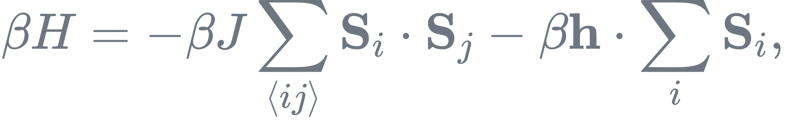

# Zoo of Classical O(N) Spin Models

This Monte Carlo simulation program evaluates the partition function $\mathcal{Z}$:

<div align="center">
  
</div>

for a *d*-dimensional O(*N*) spin model, where $d = 1, 2, 3, \ldots$ denotes the spatial dimension and $N = 1, 2, 3, \ldots$ denotes the spin dimension. $\{\mathbf{S}_i\}$ represents the summation over all possible spin configurations, and $\beta$ is the inverse temperature, defined as $1/T$. Moreover, the Hamiltonian $H$ is given by:

<div align="center">
  
</div>

with $J = 1$ (ferromagnetic coupling), leaving $\beta$ (inverse temperature) and $\mathbf{h}$ (external field) as tunable parameters.

The Swendsen–Wang and Wolff algorithms are employed for efficient configuration updates, particularly near critical points. A Metropolis version is also included.

## How to use
1. Clone the repository:
   ```bash
   git clone https://github.com/Tensofermi/Zoo_of_Classical_ON_Spin_Model
   cd Zoo_of_Classical_ON_Spin_Model
   ```

2. The file named `input.txt` contains all tunable parameters, so you can modify them as needed. Its basic structure is as follows:
   ```
   //----- Model_Parameters
   N           1                         
   D           2                                            
   beta        0.44         
   L           16      
   h           1                    

   //----- Simulation_Parameters
   Seed        987654321           
   N_Measure   1                                          
   N_Each      1000    
   N_Therm     10                                          
   N_Total     200                                          
   NBlock      1000                                 
   MaxNBin     1000000                                
   NperBin     1                     
   ```

3. Once you've determined which parameters you want to use, you can run the program simply by executing:
   ```
   ./run.sh
   ```
   To clear the generated data, use:
   ```
   ./clear.sh
   ```
   To clear everything including compiled files, use:
   ```
   ./clear_all.sh
   ```

4. For more advanced simulations:
   - Use `\lsub` to run local simulations on your PC.
   - Use `\qsub` to submit jobs to a server using the PBS system.
   - The output data will be stored in the `\data` directory.
   - You can then visualize the results using the `\plot` script.


## Features
- Simulates O(N) spin models in arbitrary spatial dimensions *d* and spin components *N*.
- Employs cluster algorithms to reduce critical slowing down.
- Measures various observables: energy-like, magnetic-like, correlation length, and cluster-related quantities.

## Phase Transitions and Universality Classes
Below is a summary of notable properties for specific values of $d$ and $N$:

| $d$      | $N$     | Phase Transition?      | Type               | Universality Class         |
|----------|---------|------------------------|--------------------|----------------------------|
| 1        | Any     | No                     | —                  | —                          |
| 2        | 1       | Yes                    | Continuous         | 2D Ising                   |
| 2        | 2       | Yes                    | BKT transition     | 2D XY                      |
| 2        | ≥3      | No                     | —                  | —                          |
| 3        | 1       | Yes                    | Continuous         | 3D Ising                   |
| 3        | 2       | Yes                    | Continuous         | 3D XY                      |
| 3        | 3       | Yes                    | Continuous         | 3D Heisenberg              |
| ≥4       | Any     | Yes                    | Continuous         | Mean-field                 | 

**Notes**:
- **BKT transition**: A topological phase transition occurring in 2D XY models ($N = 2$).
- **Mermin–Wagner theorem**: Prohibits spontaneous symmetry breaking for $N \geq 2$ in $d = 2$.

## Link

[Bilayer XY](https://github.com/Tensofermi/Bilayer_XY_Model): Two coupled 2D O(2) models, exhibiting a new emergent phase.

[Loop-Ising](https://github.com/Tensofermi/HD_Ising_IrrWorm): High-dimensional O(1) model in the loop representation.

[LR-O(n)](https://github.com/Tensofermi/LRON_SW): O(n) model with a $1/r^{d+\sigma}$ long-range interaction.